# Your IIT Counselling Helper

Your IIT Counselling Helper is a comprehensive tool designed to assist students in making informed decisions during the IIT counselling process. The website provides personalized college and branch recommendations based on the student's rank and category. It also includes various analyses, such as female reservation, old IITs vs. new IITs, and student flow using animations.

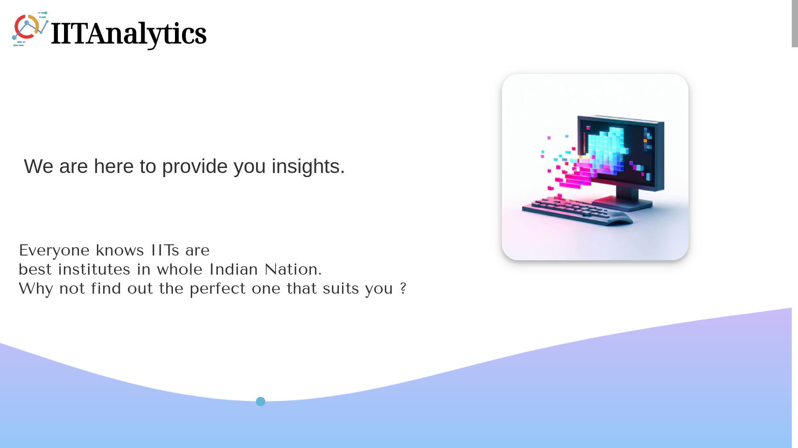

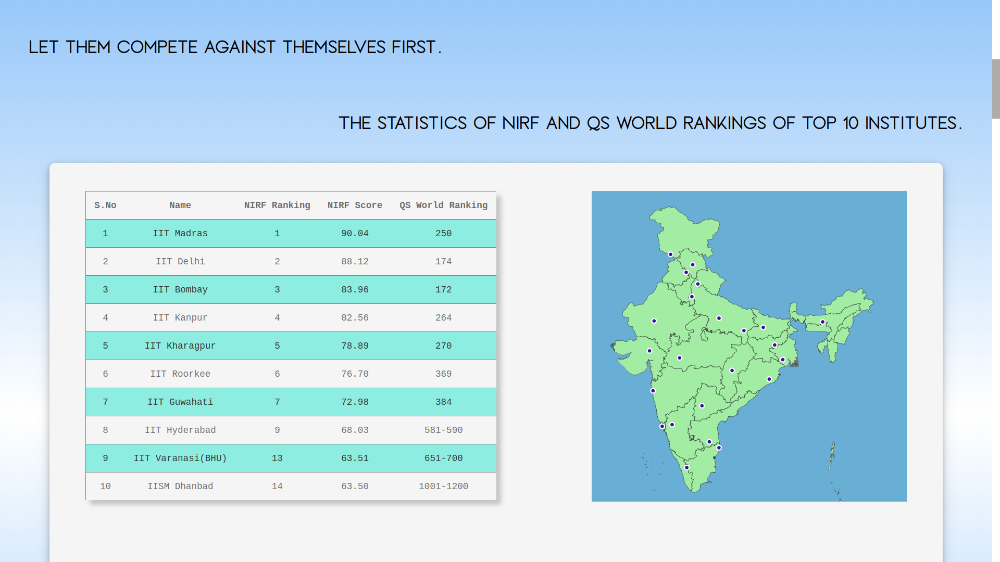

## Features

- **College and Branch Recommendations:** Get personalized recommendations based on your rank and category.
- 
  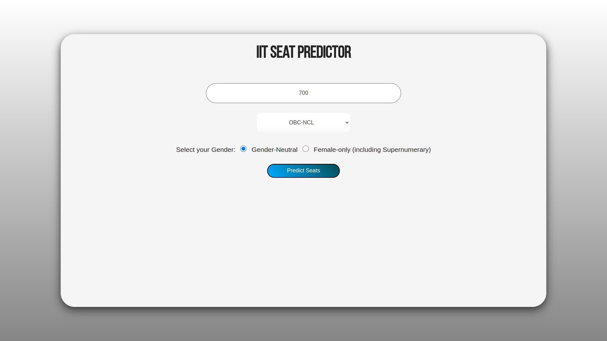
  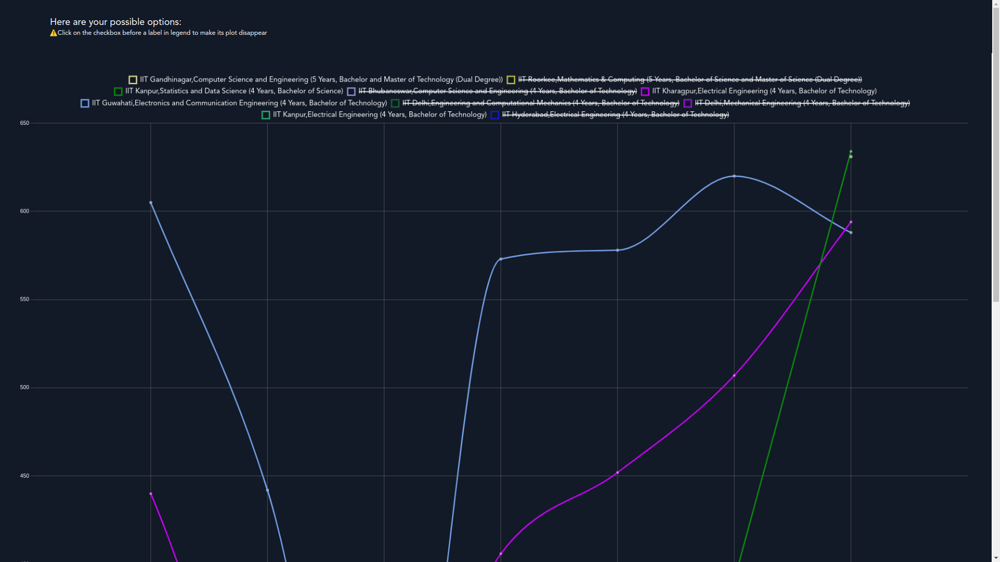
  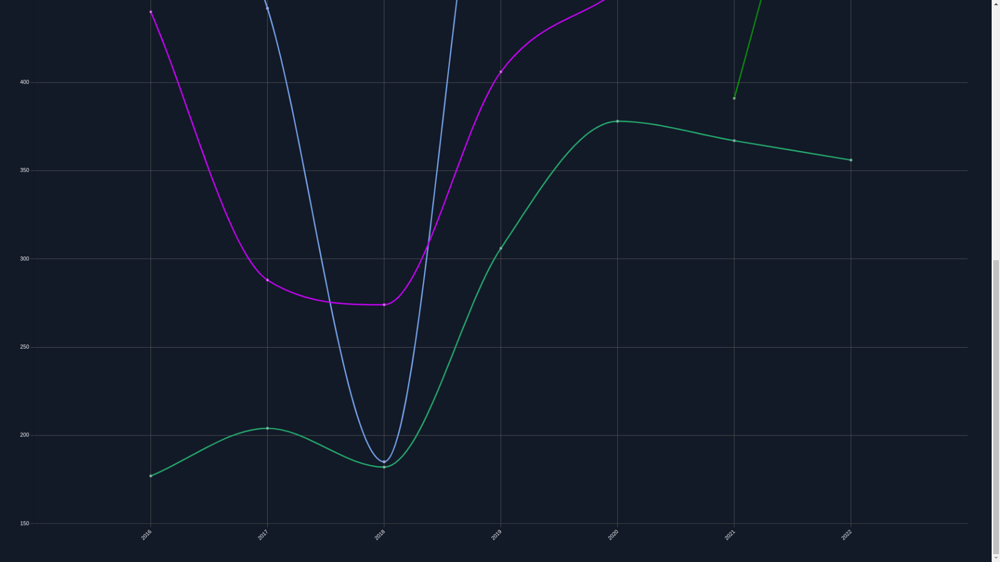

  - Different Branch analysis according to provided rank and categoty.
  
- **Female Reservation Analysis:** Understand the impact of female reservation in different IITs and branches.
  
  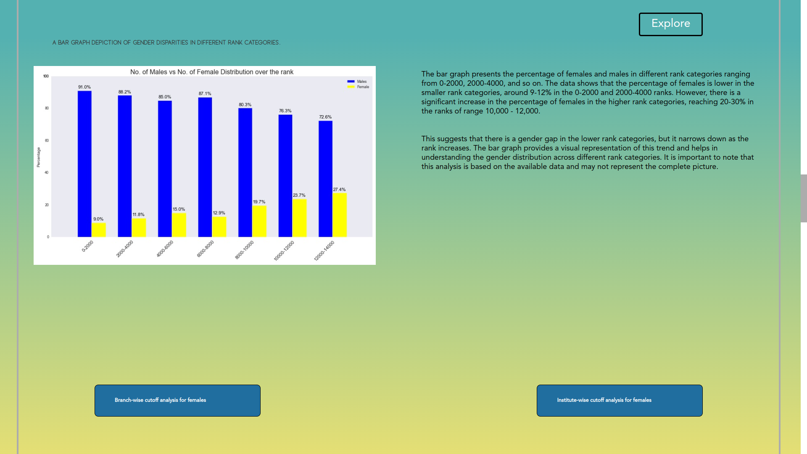
  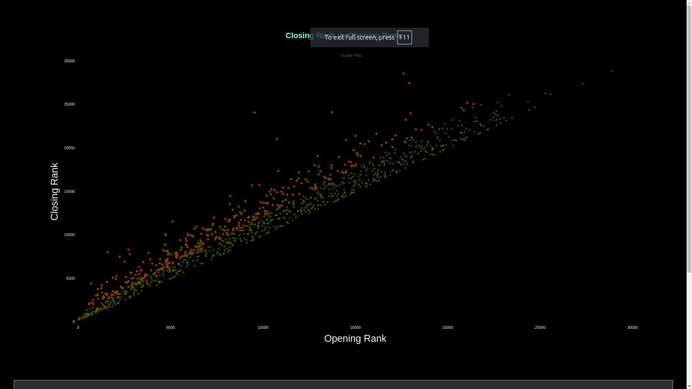
  
  _Screenshot: Analysis of female reservation across different IITs and branches._

- **Old IITs vs. New IITs:** Compare the pros and cons of old IITs versus new IITs.
  
  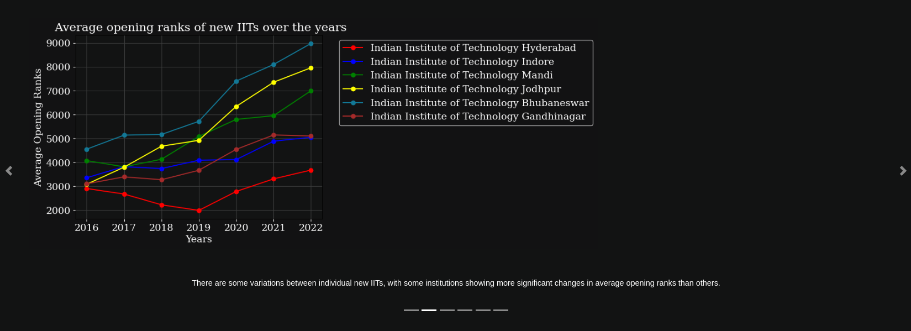
  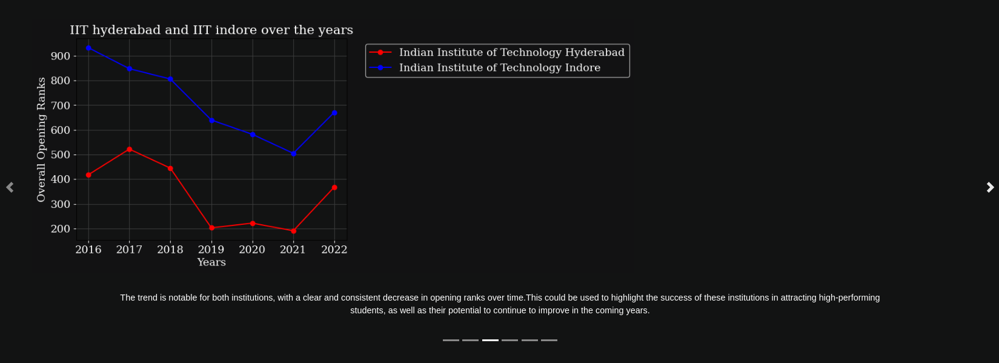
  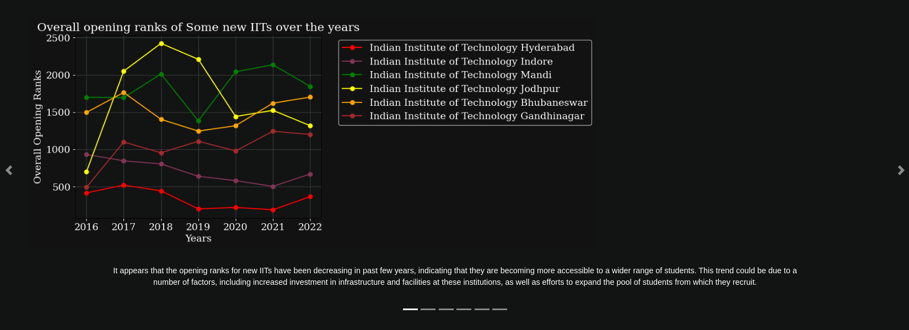
  
  _Screenshot: Comparative analysis between old and new IITs._

- **Student Flow Animation:** Visualize the flow of students across different branches and IITs through animations.
  
  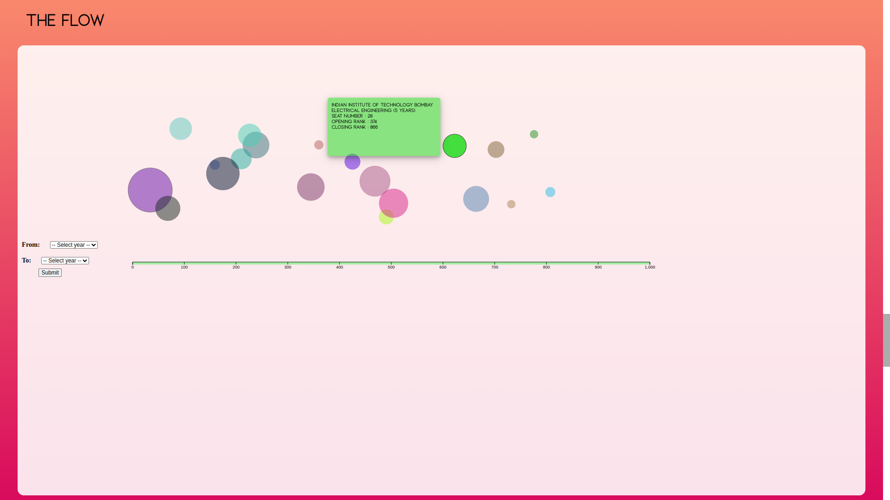
  
  _Screenshot: Animation showing the flow of students across branches._

- **Outliers Analysis:** Identify and analyze outliers in rank vs. branch preferences.
  
  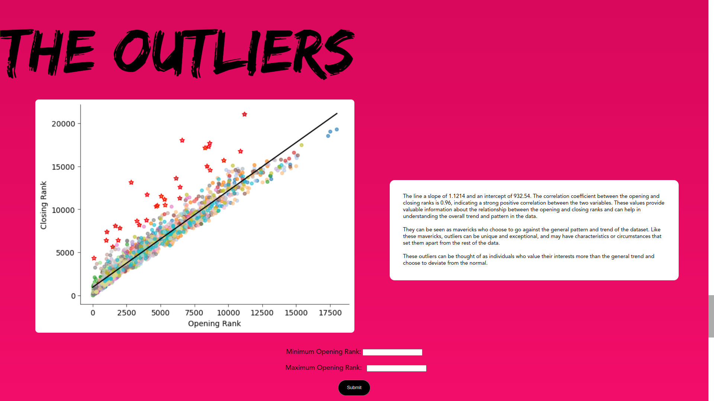
  
  _Screenshot: Outliers detected in rank vs. branch preferences._

## Installation

1. Clone the repository:
    ```bash
    git clone https://github.com/harshrajshs/Your-IIT-Counselling-Helper.git
    cd your-iit-counselling-helper
    ```

2. Install the necessary dependencies:
    ```bash
    https://www.apachefriends.org/download.html
    ```
3. Start Apache web Server and Database services.
   ```bash
    sudo ./xampp start
    ```
   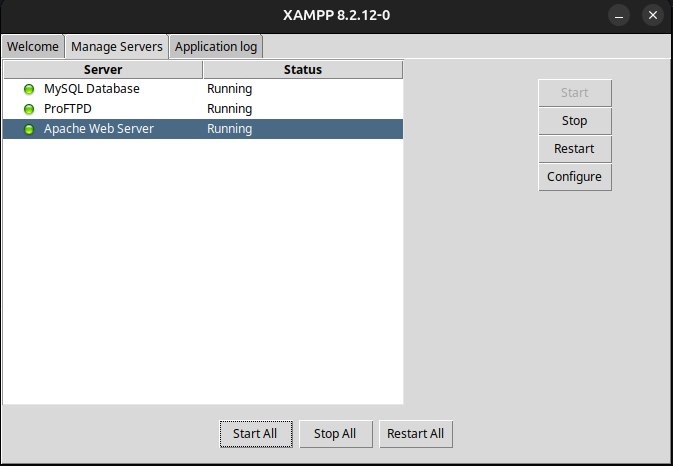

## Usage

1. Enter your rank and category on the homepage.
2. View personalized college and branch recommendations.
3. Explore additional analyses, such as female reservation and outliers.
4. Use the interactive tools and animations to better understand your options.

## Technologies Used

- **Frontend:** HTML, CSS, JavaScript
- **Backend:** PHP, MySQL
- **Database:** SQL
- **Visualization:** D3.js, Chart.js
- **Animations:** CSS Animations, JavaScript

## Contributing

Contributions are welcome! Please fork the repository and submit a pull request with your changes.

## Contact

If you have any questions or feedback, feel free to reach out at `harsh.raj@iitg.ac.in`.

---

**Note:** This project is still under development, and new features are being added regularly. Stay tuned for updates!
